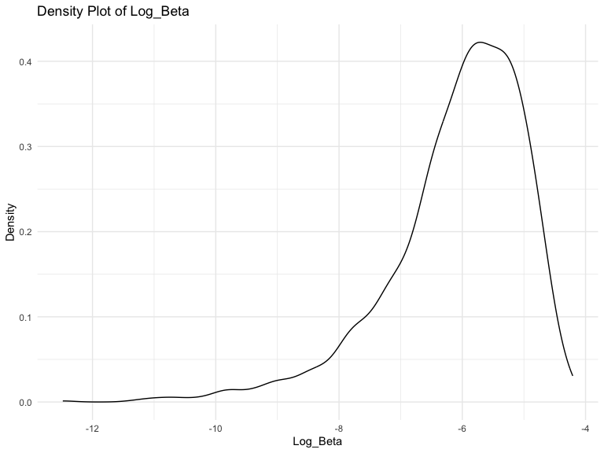

p8105_hw6_tw2918
================
2023-11-20

## Probelm 1

**Import and Clean Dataset**

- update the victim’s first and last name to proper case
- replace `unknown` to missing value `NA`
- update `victim_age` to numeric variable
- create new variable `city_state` and `case_resovled`, ane make
  `case_resovled` numeric
- filter out four `city_state` values
- filter and only keep observations if `victim_race` is white or black.

``` r
homicide_df = read_csv("./data/homicide_data.csv", show_col_types = FALSE) |>
  janitor::clean_names()|>
  mutate (
    victim_last = str_to_title(victim_last),
    victim_first = str_to_title(victim_first),
    across(c(uid, victim_last, victim_first, victim_race, victim_age, victim_sex, city, state, disposition), ~na_if(., "Unknown")),
    victim_age = as.numeric(victim_age),
    city_state = paste(city, state, sep = ", "),
    case_resolved = ifelse(grepl("Closed", disposition, ignore.case = TRUE), "1", "0"),
    case_resolved = as.numeric(case_resolved)
    )|>
  filter(
    !city_state %in% c("Tulsa, AL", "Dallas, TX", "Phoenix, AZ", "Kansas City, MO" ),
    victim_race == "White" | victim_race == "Black"
    )

print(homicide_df)
```

    ## # A tibble: 39,693 × 14
    ##    uid        reported_date victim_last  victim_first victim_race victim_age
    ##    <chr>              <dbl> <chr>        <chr>        <chr>            <dbl>
    ##  1 Alb-000003      20100601 Satterfield  Viviana      White               15
    ##  2 Alb-000005      20100102 Mula         Vivian       White               72
    ##  3 Alb-000006      20100126 Book         Geraldine    White               91
    ##  4 Alb-000009      20100130 Martin-Leyva Gustavo      White               56
    ##  5 Alb-000012      20100218 Lujan        Kevin        White               NA
    ##  6 Alb-000016      20100308 Gray         Stefania     White               43
    ##  7 Alb-000018      20100323 David        Larry        White               52
    ##  8 Alb-000019      20100402 Brito        Elizabeth    White               22
    ##  9 Alb-000021      20100423 King         Tevion       Black               15
    ## 10 Alb-000022      20100423 Boykin       Cedric       Black               25
    ## # ℹ 39,683 more rows
    ## # ℹ 8 more variables: victim_sex <chr>, city <chr>, state <chr>, lat <dbl>,
    ## #   lon <dbl>, disposition <chr>, city_state <chr>, case_resolved <dbl>

**Logistic regression on city of Balitmore, MD**

For the city of `Baltimore, MD`, use the `glm` function to fit a
logistic regression with `resolved` vs `unresolved` as the outcome and
victim age, sex and race as predictors. Save the output of `glm` as an
`R object`;

``` r
fit_logistic = homicide_df |>
  filter(city_state == "Baltimore, MD")|>
  glm(case_resolved ~ victim_age + victim_sex + victim_race,data = _, family = binomial())

print(fit_logistic)
```

    ## 
    ## Call:  glm(formula = case_resolved ~ victim_age + victim_sex + victim_race, 
    ##     family = binomial(), data = filter(homicide_df, city_state == 
    ##         "Baltimore, MD"))
    ## 
    ## Coefficients:
    ##      (Intercept)        victim_age    victim_sexMale  victim_raceWhite  
    ##         0.663792         -0.005205         -1.036564          0.899714  
    ## 
    ## Degrees of Freedom: 2752 Total (i.e. Null);  2749 Residual
    ## Null Deviance:       3717 
    ## Residual Deviance: 3619  AIC: 3627

apply the `broom::tidy` to this object; and obtain the estimate and
confidence interval of the adjusted odds ratio for solving homicides
comparing male victims to female victims keeping all other variables
fixed.

``` r
fit_logistic|>
  broom::tidy()|>
  filter(term == "victim_sexMale")|>
  mutate(OR = exp(estimate),
         ci_lower = exp(estimate - (1.96 * std.error)),
         ci_upper = exp(estimate + (1.96 * std.error))
      )|>
  select(term, OR, ci_lower, ci_upper)|>
  knitr::kable(digits = 3)
```

| term           |    OR | ci_lower | ci_upper |
|:---------------|------:|---------:|---------:|
| victim_sexMale | 0.355 |    0.268 |    0.469 |

**Logistic regression on each of the city**

run `glm` for each of the cities in your dataset, and extract the
adjusted odds ratio (and CI) for solving homicides comparing male
victims to female victims. Do this within a “tidy” pipeline, making use
of `purrr::map`, `list columns`, and `unnest` as necessary to create a
dataframe with estimated ORs and CIs for each city.

``` r
fit_logistic_allcity = homicide_df |>
    nest(df = -city_state)|>
  mutate(
    glm_model = purrr::map(df, \(df) 
                     glm(case_resolved ~ victim_age + victim_sex + victim_race,data =df, family = binomial())),
    glm_result = map (glm_model, broom::tidy)
  )|>
  select(city_state, glm_result)|>
  unnest(glm_result)|>
  filter(term == "victim_sexMale")|>
  mutate(OR = exp(estimate),
         ci_lower = exp(estimate - (1.96 * std.error)),
         ci_upper = exp(estimate + (1.96 * std.error))
      )|>
  select(city_state, OR, ci_lower, ci_upper)

print(fit_logistic_allcity)
```

    ## # A tibble: 47 × 4
    ##    city_state         OR ci_lower ci_upper
    ##    <chr>           <dbl>    <dbl>    <dbl>
    ##  1 Albuquerque, NM 0.430    0.148    1.25 
    ##  2 Atlanta, GA     0.512    0.328    0.799
    ##  3 Baltimore, MD   0.355    0.268    0.469
    ##  4 Baton Rouge, LA 0.319    0.166    0.612
    ##  5 Birmingham, AL  0.704    0.450    1.10 
    ##  6 Boston, MA      0.667    0.354    1.26 
    ##  7 Buffalo, NY     0.438    0.241    0.796
    ##  8 Charlotte, NC   0.301    0.151    0.598
    ##  9 Chicago, IL     0.391    0.321    0.476
    ## 10 Cincinnati, OH  0.206    0.104    0.408
    ## # ℹ 37 more rows

**Plot for OR and CI**

Create a plot that shows the estimated ORs and CIs for each city.
Organize cities according to estimated OR, and comment on the plot.

``` r
fit_logistic_allcity |>
  mutate(city_state = reorder(city_state, OR))|>
  ggplot(aes(x=city_state, y =OR)) +
  geom_point() +
  geom_errorbar(aes(ymin = ci_lower, ymax = ci_upper))+
  labs(
    title = "Estimated OR and Confidance Interval of Solving Homicides Comparing Male to Female Victims in Each City ",
    x = "Cities and States",
    y = "Estimated OR",
  ) +
  theme(axis.text.x =element_text(angle = 90, hjust = 1))
```


*Comment on the plot*

- The plot shows the estimated OR and confidence intervals for solving
  homicides, comparing male to female victims in each cities and we are
  95% confidence that the true OR lies between the confidence intervals.
  If the confidence interval cross y=1, then there’s no significant
  evidence of a difference in the odds of solving homicides between male
  and female victims.That is the case 15 out of 47 cities.
- We also see that most of the estimated OR is less than 1, which
  suggests that in most states male victims’ homicides are less likely
  to be solved compared to female victims’ homicides in that city.
  That’s the case for all evidence of a difference in the odds of
  solving homicides between male and female victims. For the 3 cities
  with estimated OR above 1, they all have CI including the value of 1
  that suggested no true difference.
- Some cities also have wide confidence intervals, which is the cities
  with CI cross the value of 1, which could indicate a small sample size
  or high variability within the data for those cities, which may be the
  causes for insignificant results.

## Problem 2

**Import and Clean Dataset**

``` r
weather_df = 
  rnoaa::meteo_pull_monitors(
    c("USW00094728"),
    var = c("PRCP", "TMIN", "TMAX"), 
    date_min = "2022-01-01",
    date_max = "2022-12-31") |>
  mutate(
    name = recode(id, USW00094728 = "CentralPark_NY"),
    tmin = tmin / 10,
    tmax = tmax / 10) |>
  select(name, id, everything())
```

    ## using cached file: /Users/tianyiwang/Library/Caches/org.R-project.R/R/rnoaa/noaa_ghcnd/USW00094728.dly

    ## date created (size, mb): 2023-09-28 07:19:06.75893 (8.524)

    ## file min/max dates: 1869-01-01 / 2023-09-30

\*\* Linear Regression and bootstrap\*\*

Fit simple linear regression with tmax as the response with tmin and
prcp as the predictors. Use 5000 bootstrap samples and, for each
bootstrap sample, produce estimates of `r_squared` and `log(β0∗β1)`

``` r
# set function draw a size from the dataframe of the exact size of the dataframe
boot_sample = function (df) {

  sample_frac(df, replace = TRUE)
  
}

# run bootstrap
boot_result = 
  tibble(strap_number = 1:5000) |>
  mutate(
    strap_sample = map(strap_number, \(i) boot_sample(weather_df)),
    models = map(strap_sample, \(df) lm (tmax ~ tmin + prcp, data = df)),
    r_squared = map(models, broom::glance),
    results = map(models, broom::tidy)
  )|>
  select(strap_number, results, r_squared) |>
  unnest(results, r_squared)|>
  select(strap_number, term, estimate, r.squared)|>
  pivot_wider(
    names_from = "term",
    values_from = "estimate" 
  )|>
  janitor:: clean_names()|>
  #questions, log(b0*b1) or log(b1*b2)
  mutate(
    log_beta= log(intercept*tmin)
  )|>
  select(strap_number, r_squared, log_beta)

print(boot_result)
```

    ## # A tibble: 5,000 × 3
    ##    strap_number r_squared log_beta
    ##           <int>     <dbl>    <dbl>
    ##  1            1     0.898     2.11
    ##  2            2     0.928     2.10
    ##  3            3     0.925     2.12
    ##  4            4     0.931     2.11
    ##  5            5     0.915     2.11
    ##  6            6     0.918     2.08
    ##  7            7     0.922     2.10
    ##  8            8     0.910     2.07
    ##  9            9     0.910     2.09
    ## 10           10     0.939     2.10
    ## # ℹ 4,990 more rows

Plot the distribution of your estimates, and describe these in words.

``` r
#R squared plot
boot_result|>
  ggplot(aes(x=r_squared)) +
  geom_density()+
  labs(title = "Density Plot of R_Squared", 
       x = "R_Squared", 
       y = "Density" 
       )
```


``` r
# log_beta plot
boot_result|>
  ggplot(aes(x=log_beta)) +
  geom_density()+
  labs(title = "Density Plot of Log_Beta", 
       x = "Log_Beta", 
       y = "Density" 
       )
```



*Comment on the Plot*

- The density plot for r_squared if approximatly symmetric around the
  peak, but there appears to be a slight skew to the right, indicating
  that there are a number of R_Squared values higher than the mode.The
  tails of the distribution taper off, with fewer observations having
  very low or very high R_Squared values.
- The density plot for log(beta0\*beta1) shows symmetry around the peak,
  with a bell-shaped curve that is typical of a normal distribution.The
  peak of the Log_Beta density curve is around 2.10, which is the mode
  of this distribution.

Using the 5000 bootstrap estimates, identify the 2.5% and 97.5%
quantiles to provide a 95% confidence interval for the two estimate.

``` r
boot_result |>
  pivot_longer(
    r_squared:log_beta,
    names_to = "estimate",
    values_to = "value"
  )|>
  group_by(estimate)|>
  summarize(
    ci_lower = quantile(value, 0.025),
    ci_upper = quantile(value, 0.075)
  )|>
  knitr::kable(digits = 3)
```

| estimate  | ci_lower | ci_upper |
|:----------|---------:|---------:|
| log_beta  |    2.055 |    2.067 |
| r_squared |    0.889 |    0.897 |
